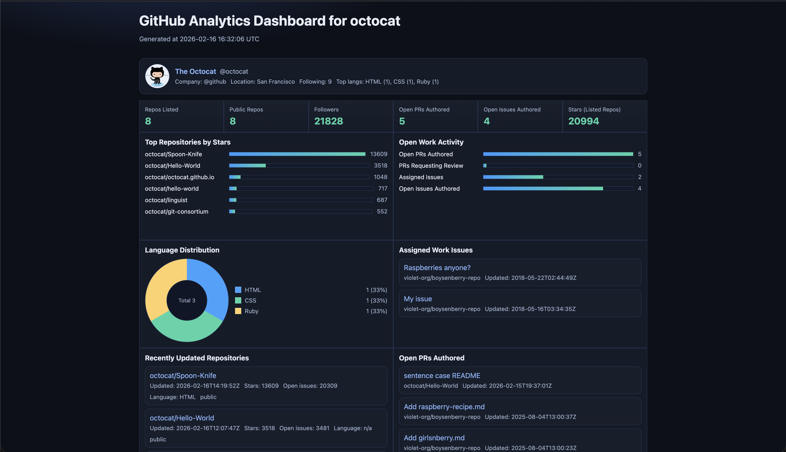

# GitHub Analytics Dashboard (Terraform/OpenTofu)

GitHub user analytics dashboard generated as an HTML app using Terraform/OpenTofu + Python, with optional AWS deployment.

## Features

- HTML dashboard (`dashboard.html`) rendered with embedded JavaScript
- User profile analytics from GitHub API
- Repository, PR, and issue sections
- Charting in dashboard:
  - Bar charts (stars, activity mix)
  - Pie chart (language split)
- Local generation with Terraform/OpenTofu + Python
- Optional AWS S3 static website hosting
- Optional AWS Lambda + EventBridge scheduled refresh (updates S3 `index.html`)

## Dashboard Layout

- Summary cards:
  - Repos listed
  - Public repos
  - Followers
  - Open PRs authored
  - Open issues authored
  - Stars (listed repos)
- Chart/insight row:
  - Top Repositories by Stars (bar)
  - Open Work Activity (bar)
  - Language Distribution (pie)
  - Assigned Work Issues (list card)
- Main list row:
  - Recently Updated Repositories (limited to 3 items)
  - Open PRs Authored
  - PRs Requesting Review
  - Authored Open Issues

## Screenshots



## Project Structure

```text
.
├── .gitignore
├── README.md
├── versions.tf
├── variables.tf
├── main.tf
├── aws.tf
├── aws_lambda.tf
├── outputs.tf
├── terraform.tfvars.example
├── docs/
│   └── screenshots/
│       └── .gitkeep
├── scripts/
│   └── fetch_github_dashboard.py
├── templates/
│   └── dashboard.html.tftpl
└── lambda/
    └── dashboard_refresher.py
```

## File Responsibilities

- `versions.tf`: Terraform/OpenTofu + provider requirements.
- `variables.tf`: all input variables (GitHub, output, AWS, Lambda schedule).
- `main.tf`: runs external Python fetcher, renders HTML template, writes local file.
- `aws.tf`: optional S3 website resources and `index.html` upload.
- `aws_lambda.tf`: optional Lambda, IAM, logs, and EventBridge schedule.
- `outputs.tf`: local file path, generation time, website URL, lambda outputs.
- `scripts/fetch_github_dashboard.py`: fetches GitHub data and returns JSON to Terraform.
- `templates/dashboard.html.tftpl`: HTML/CSS/JS dashboard UI and chart rendering.
- `lambda/dashboard_refresher.py`: Lambda function that refreshes S3 dashboard on schedule.

## Requirements

- `tofu` or `terraform` (v1.5+)
- `python3`
- GitHub token optional (recommended for better API limits/private data access)
- AWS credentials only required when using S3/Lambda features

## Quick Start (Local HTML)

1. Create variables file:

```bash
cp terraform.tfvars.example terraform.tfvars
```

2. Set local-only values in `terraform.tfvars`:

```hcl
github_profile             = "octocat" # URL or username
github_token               = ""        # optional
aws_bucket_name            = ""        # disable AWS publish
enable_lambda_auto_refresh = false
```

3. Run:

```bash
tofu init
tofu apply -auto-approve
open dashboard.html
```

Use `terraform` commands instead of `tofu` if preferred.

## AWS S3 Deployment (Optional)

Set in `terraform.tfvars`:

```hcl
aws_region      = "us-east-1"
aws_bucket_name = "your-unique-bucket-name"
```

Then apply:

```bash
tofu apply -auto-approve
```

Output `s3_website_url` gives the hosted dashboard endpoint.

## AWS Lambda Scheduled Refresh (Optional)

Set in `terraform.tfvars`:

```hcl
aws_bucket_name             = "your-unique-bucket-name"
enable_lambda_auto_refresh  = true
lambda_schedule_expression  = "rate(6 hours)"
lambda_log_retention_days   = 14
```

What gets created:
- Lambda function for refresh
- IAM role + inline policy
- CloudWatch Log Group
- EventBridge rule + target + invoke permission

Lambda reads GitHub, regenerates dashboard HTML, writes to S3 `index.html`.

## Variables

Core:
- `github_profile`: target GitHub profile URL or username.
- `github_username`: fallback username input.
- `github_token`: optional token.
- `organizations`: optional org repos to include.
- `include_private_repos`: include private repos when token allows.
- `max_repositories`: repo section size.
- `max_items_per_section`: PR/issue section size.
- `output_file`: local HTML output path.

AWS:
- `aws_region`
- `aws_bucket_name`
- `aws_force_destroy`

Lambda:
- `enable_lambda_auto_refresh`
- `lambda_schedule_expression`
- `lambda_log_retention_days`

## Outputs

- `dashboard_file`
- `dashboard_generated_at`
- `s3_website_url` (when S3 enabled)
- `lambda_refresh_function_name` (when Lambda enabled)
- `lambda_refresh_schedule_expression` (when Lambda enabled)

## Troubleshooting

- `InvalidClientTokenId`:
  - AWS credentials are invalid, but AWS mode is enabled.
  - Fix by setting `aws_bucket_name = ""` for local-only mode, or configure valid AWS credentials.
- `templatefile ... Invalid character ... \``:
  - JS interpolation in template must be escaped as `$${...}` in `templates/dashboard.html.tftpl`.
  - Terraform interpolation remains `${...}`.
- GitHub rate limits / missing private data:
  - Set a valid `github_token`.

## Notes

- Re-run `apply` to refresh data.
- Keep tokens out of version control.
- Dashboard output is HTML + embedded JavaScript (no frontend build system required).
- The Lambda renderer in `lambda/dashboard_refresher.py` has its own embedded HTML template, so if you change UI in `templates/dashboard.html.tftpl`, update Lambda HTML too to keep them aligned.
